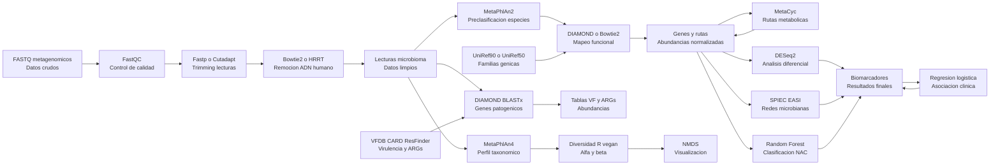

Los archivos con los que se están probando los scripts son:

- CAMISIM_Illumina_R1.anonymous.G0_T0.fq.gz   2.2G
- CAMISIM_Illumina_R2.anonymous.G0_T0.fq.gz   2.3G

Se pueden descargar de esta web: https://zenodo.org/records/5155395

